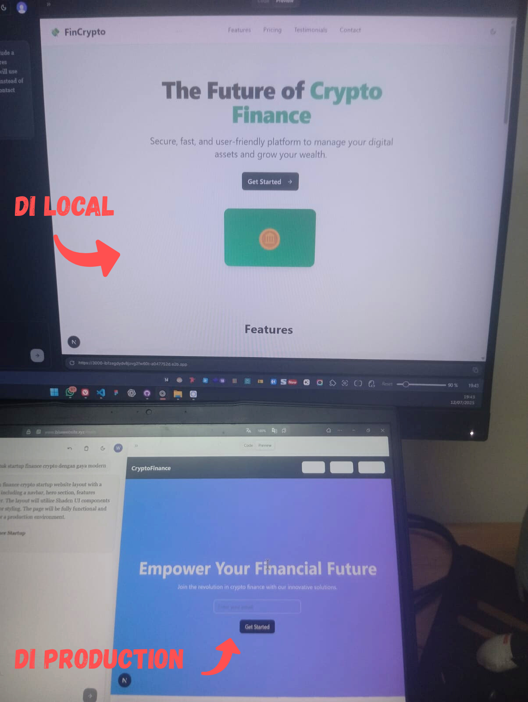

# Bisa Website App

<!-- Ganti dengan Markdown image syntax agar tampil di GitHub -->
<p align="center">
  
</p>

Hasilnya lebih bagus di local daripada di production

Prompt sama, code sama, hasil generate beda, anda aja bingung, apalagi saya

## 🚀 Fitur Utama

- **AI Chat Generation**: Generate kode menggunakan berbagai model LLM (GPT-4)
- **Code Sandbox**: Jalankan kode secara aman di environment terisolasi menggunakan E2B
- **Real-time Preview**: Lihat hasil kode langsung di browser
- **Rate Limiting**: Kontrol penggunaan API dengan sistem rate limiting
- **Authentication**: Sistem autentikasi menggunakan Clerk

## 🛠️ Tech Stack

- **Framework**: Next.js 14 dengan App Router
- **AI/LLM**: Vercel AI SDK, OpenAI
- **Sandbox**: E2B Code Interpreter
- **Authentication**: Clerk
- **Styling**: Tailwind CSS + shadcn/ui
- **Monitoring**: LangSmith
- **Database**: Supabase (opsional)

## 📁 Struktur Project

```
src/
├── app/
│   ├── api/
│   │   └── ai/
│   │       ├── route.ts         # Main router (backward compatibility)
│   │       ├── chat/route.ts    # AI chat endpoint
│   │       └── sandbox/route.ts # Code execution endpoint
│   ├── (auth)/                  # Authentication pages
│   ├── (landingpage)/          # Landing page
│   └── main/                   # Main application
├── components/                 # Reusable UI components
├── lib/                       # Utilities & configurations
├── inngest/                   # Background job functions
└── types/                     # TypeScript type definitions
```

## 📄 License

Distributed under the MIT License. See `LICENSE` for more information.

## 👤 Author

**Wahyu** - [@wahyudesu](https://github.com/wahyudesu)

---